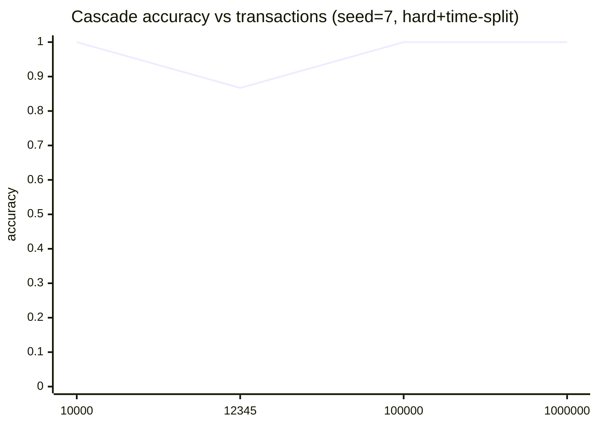
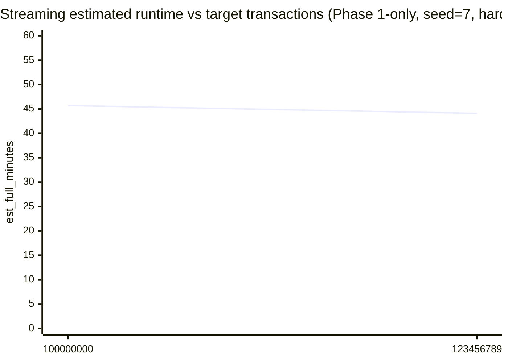
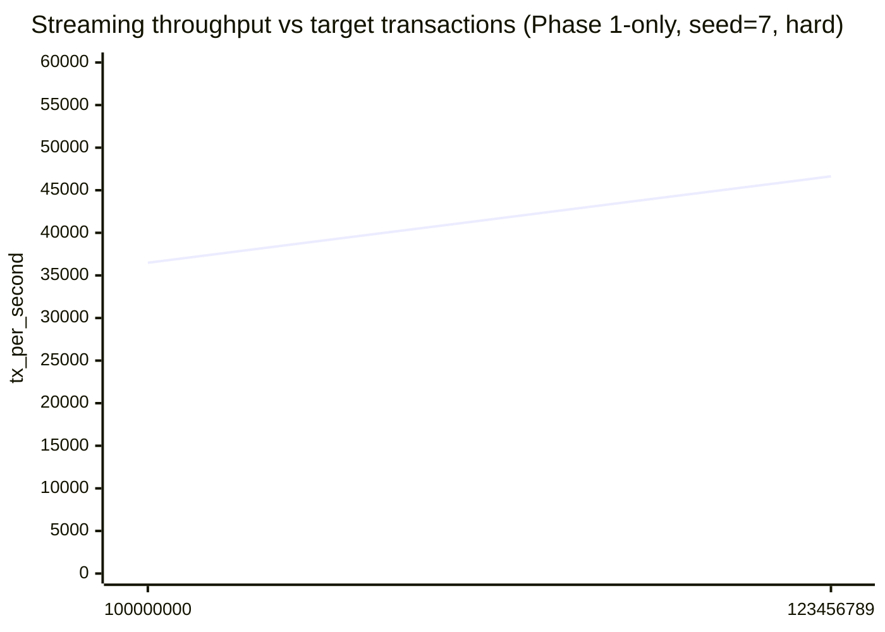
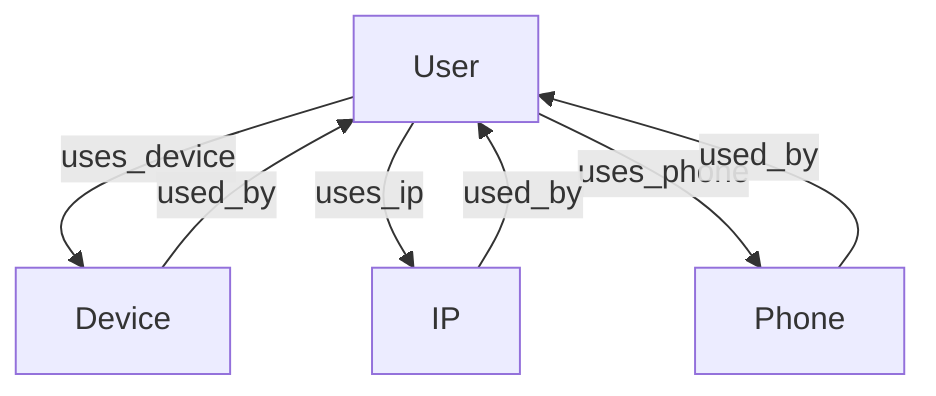
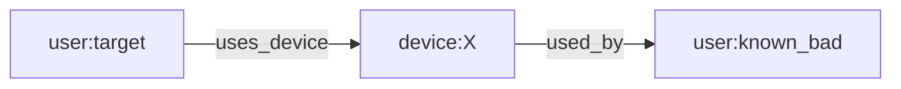
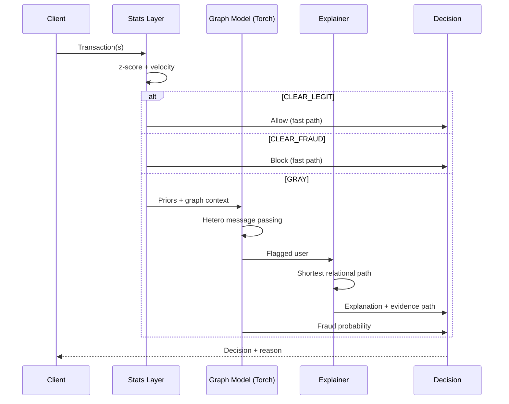

# The Hybrid-Recursive Fraud Defense System

Bridging Deterministic Statistics and Heterogeneous Graph Learning

This repo is a small, readable demo of a two-stage fraud detection cascade:

1. **Deterministic statistics filter** (fast, interpretable)

- Z-score thresholding on amounts
- Velocity checks (txn frequency burst)
- Outputs a **deterministic anomaly score** used as a prior feature

2. **Heterogeneous Graph GNN** (relational reasoning)

- Node types: `user`, `device`, `ip`, `phone`
- Edge types: `user->device`, `user->ip`, `user->phone` (+ reverse edges)
- Trains a small **Hetero-GAT** model on the gray-area subset

3. **Explainable business logic** (actionable paths)

- Produces a shortest **k-hop relational path** from a flagged user to a known-bad anchor node.

---

# Additional tracks (1, 2, 4)

You said track **3** (Fraud Detection, business-logic layer) is done.

This repo also includes 3 extra, lightweight demos that match hackathon problem statements:

- **Track 1 — Credit scoring / creditworthiness**: [src/credit_scoring.py](src/credit_scoring.py)
- **Track 2 — Personalized financial advisory**: [src/advisory.py](src/advisory.py)
- **Track 4 — Cybersecurity threat detection**: [src/cyber_threat.py](src/cyber_threat.py)

All three are intentionally:

- simple baselines (strong enough for demo, easy to explain)
- fast on CPU
- interpretable (prints reasons / coefficients)

## Assumptions + covered scenarios (synthetic demo)

This demo intentionally focuses on **relational fraud rings** ("business logic" abuse), not only single-transaction outliers.

Covered patterns:

- **Collusive rings**: groups of users share a small set of devices/IPs/phones.
- **Bursty behavior**: high velocity inside a short time window.
- **Higher amounts**: fraud transactions tend to have larger lognormal amounts.
- **Gray-area routing**: obvious cases are filtered by stats; complex cases go to the graph model.

Not covered yet (real-world extensions):

- Concept drift over weeks/months, seasonality, and changing attacker strategies.
- Chargeback delays / label noise / partial labels.
- Temporal graph modeling (we treat the graph as static for simplicity).
- Rich device fingerprints and text features.

Additional edge cases to think about (hackathon-style):

- **False positive traps**: shared household devices, corporate NAT, campus Wi-Fi, internet cafes.
- **Adversarial adaptation**: rotating devices/IPs, spacing transactions to evade velocity, camouflaging amounts.
- **Cold-start**: new users/devices/IPs with little history.
- **Sparse graphs**: users with only 1 edge type (device-only / IP-only).
- **Dense hubs**: popular devices/IPs (support, kiosks) that connect many users.
- **Operational constraints**: latency budgets, fail-open/fail-closed, and backpressure.
- **Data quality**: missing phone/device, duplicated IDs, timestamp skew.
- **Label quality**: delayed fraud confirmation, disputed transactions, partial labels.

## Scenario library (1000 cases)

For hackathon pitching and test planning, generate a large case library:

```bash
.\.venv\Scripts\python.exe -m src.case_library --n 1000 --out docs/cases.md
```

Output: [docs/cases.md](docs/cases.md)

## Results (quick validation)

We report **Cascade** metrics (stats for CLEAR + graph model for GRAY) on the **test user split**.

These numbers are from the **exact commands listed** in the validation report. Results can vary with seed, epochs, and hard-mode noise.

Multi-run stress test (hard mode + time split), mean ± std over 5 seeds:

| Metric          |           Value |
| --------------- | --------------: |
| accuracy        | 0.9644 ± 0.0606 |
| precision_fraud | 0.8637 ± 0.2086 |
| recall_fraud    | 1.0000 ± 0.0000 |
| f1_fraud        | 0.9109 ± 0.1428 |
| fpr             | 0.0410 ± 0.0699 |

Scaling spot-checks (seed=7, hard+time-split):

| Transactions | Epochs | accuracy | precision_fraud | recall_fraud | f1_fraud |   fpr |
| -----------: | -----: | -------: | --------------: | -----------: | -------: | ----: |
|       10,000 |     15 |    1.000 |           1.000 |        1.000 |    1.000 | 0.000 |
|       12,345 |     15 |    0.867 |           0.500 |        1.000 |    0.667 | 0.154 |
|      100,000 |     15 |    1.000 |           1.000 |        1.000 |    1.000 | 0.000 |
|    1,000,000 |      5 |    1.000 |           1.000 |        1.000 |    1.000 | 0.000 |

Full command log + diagrams: [docs/validation_results.md](docs/validation_results.md)



### Huge-scale streaming benchmark (Phase 1-only)

For very large transaction counts, we benchmark Phase 1 in streaming mode and estimate full runtime.

Command used (seed=7, hard mode, benchmark slice = 2,000,000 tx):

| Target Transactions |     Slice | elapsed (s) | speed (tx/s) | est_full (min) | user_thr | accuracy | precision_fraud | recall_fraud | f1_fraud |   fpr |
| ------------------: | --------: | ----------: | -----------: | -------------: | -------: | -------: | --------------: | -----------: | -------: | ----: |
|         100,000,000 | 2,000,000 |       54.81 |       36,488 |           45.7 |     0.15 |    1.000 |           1.000 |        1.000 |    1.000 | 0.000 |
|         123,456,789 | 2,000,000 |       42.89 |       46,634 |           44.1 |     0.15 |    1.000 |           1.000 |        1.000 |    1.000 | 0.000 |





## Diagrams

### 1) End-to-end system architecture

```mermaid
flowchart LR
	A[Incoming Transactions] --> B[Phase 1: Statistical Filter]
	B -->|CLEAR_LEGIT| L[Allow / Low Risk]
	B -->|CLEAR_FRAUD| F[Block / High Risk]
	B -->|GRAY| G[Phase 2: Heterogeneous Graph Model]
	B --> P[Deterministic Priors\n(anomaly_score, velocity, z-score)]
	P --> G
	G --> S[Phase 3: Explanation\n(shortest relational path)]
	G --> D[Final Decision]
	S --> D
```

### 2) Data model (heterogeneous graph)



### 3) What an explanation looks like



### 4) Sequence diagram (request to decision)



### 5) Deployment diagram (simple production shape)

```mermaid
flowchart TB
	subgraph Online
		API[Fraud API]
		ST[Stats Filter Service]
		MS[Model Service\n(Torch MPNN)]
		EX[Explanation Service]
	end

	subgraph Data
		FS[Feature Store\n(priors, velocity, z-score)]
		GS[Graph Store\n(user-device-ip-phone edges)]
		LG[Logging / Monitoring]
	end

	API --> ST
	ST -->|CLEAR| API
	ST --> FS
	ST -->|GRAY| MS
	MS --> GS
	MS --> EX
	EX --> API
	API --> LG
```

## Quickstart

If running `python` opens the Microsoft Store on Windows, use the Python Launcher instead: `py`.

### 1) Create env + install deps

```bash
python -m venv .venv
.\.venv\Scripts\activate
pip install -r requirements.txt
```

### 2) (Optional, recommended) Install Torch + DGL

DGL installation depends on your platform/CUDA.

- Install **PyTorch** from the official selector.
- Then install **DGL** following its official install guide.

If Torch is not installed, the project still runs the **statistical layer** and prints outputs, but skips the GNN training.

CPU-only PyTorch (Windows, highest success):

```bash
pip install torch torchvision torchaudio --index-url https://download.pytorch.org/whl/cpu
```

### 3) Run the demo

```bash
py -m src.train

# If `python` is a Microsoft Store alias, this always works:
.\.venv\Scripts\python.exe -m src.train
```

## Track 1 — Credit Scoring

Run:

```bash
.\.venv\Scripts\python.exe -m src.credit_scoring --n 8000 --underbanked-rate 0.35 --show-explain
```

Output highlights (for screenshots):

- chosen threshold on validation
- test metrics + confusion counts
- subgroup metrics: `banked` vs `underbanked`
- top positive/negative logistic regression coefficients

## Track 2 — Personalized Financial Advisory

Run:

```bash
.\.venv\Scripts\python.exe -m src.advisory --n 2000 --market-stress 0.00 --show 5
.\.venv\Scripts\python.exe -m src.advisory --n 2000 --market-stress 0.75 --show 5
```

Output highlights:

- risk score percentiles (p10/p50/p90)
- equity weight percentiles (dynamic risk)
- monthly savings needed to hit goals
- sample action plan per customer (goal-based + risk-based)

## Track 4 — Cybersecurity Threat Detection (Technical Layer)

Run:

```bash
.\.venv\Scripts\python.exe -m src.cyber_threat --n-events 200000 --attack-rate 0.02 --show 8

# Huge-scale (100M+) screenshot-friendly benchmark:
.\.venv\Scripts\python.exe -m src.cyber_threat --n-events 100000000 --attack-rate 0.02 --benchmark-events 2000000 --show 8
.\.venv\Scripts\python.exe -m src.cyber_threat --n-events 123456789 --attack-rate 0.02 --benchmark-events 2000000 --show 8
```

Latest huge-scale benchmark results (seed=7, benchmark slice=2,000,000 events):

| Target Events |     Slice | elapsed (s) | speed (ev/s) | est_full (min) | accuracy | precision_attack | recall_attack | f1_attack |   fpr |
| ------------: | --------: | ----------: | -----------: | -------------: | -------: | ---------------: | ------------: | --------: | ----: |
|   100,000,000 | 2,000,000 |       32.55 |       61,445 |           27.1 |    0.983 |            0.996 |         0.175 |     0.298 | 0.000 |
|   123,456,789 | 2,000,000 |       31.72 |       63,058 |           32.6 |    0.983 |            0.996 |         0.175 |     0.298 | 0.000 |

Output highlights:

- event throughput (ev/s) + elapsed time
- precision/recall/F1 for attacks + FPR
- flagged examples with reasons like `failed_login_burst`, `bytes_out_spike`, `new_device_far_geo`

---

## PHASE 2 — Ghost Protocol (Privacy & Stealth Compliance)

Demo module: [src/privacy.py](src/privacy.py)

Run:

```bash
.\.venv\Scripts\python.exe -m src.privacy --n 50000 --nodes 5 --show 5
```

Output highlights:

- `private_settlement_verified` pass rate
- `blind_audit_anchor (merkle_root)` as a system-wide audit anchor
- `shadow metadata shards` (hashed + sharded, no plaintext)

Note: this is an API/architecture demo, not production ZK-SNARK/HE.

## PHASE 3 — Neural Sentinel (Autonomous Defense)

Demo module: [src/sentinel.py](src/sentinel.py)

Run (safe auto-mitigation via threshold tuning; no self-modifying code):

```bash
.\.venv\Scripts\python.exe -m src.sentinel --hard --n-transactions 1000000 --benchmark-transactions 500000
```

Output highlights:

- baseline self-check metrics parsed from `src.train`
- if metrics violate policy, proposes a safer `PHASE1_THRESHOLD` (grid-search)

---

## PHASE 4 — The Liquidity Vortex (Hyperbolic AMM Demo)

Demo module: [src/liquidity_vortex.py](src/liquidity_vortex.py)

This is a simple, CPU-friendly AMM simulator using a **hyperbolic (non-Euclidean) bonding curve** and a **volatility-adaptive slope**.

Run:

```bash
.\.venv\Scripts\python.exe -m src.liquidity_vortex --n-trades 1000000 --benchmark-trades 200000 --show 3
```

Output highlights:

- `slippage_bps` mean / p95 / max
- throughput (trades/s) + `est_full` time estimate
- alpha range (how the curve steepens under volatility)

Note: demo-only AMM math; no claim of eliminating impermanent loss.

## Run everything (tracks 1,2,3,4)

If you want one command that prints everything in order (useful for screenshots), run:

```bash
.\.venv\Scripts\python.exe -m src.run_all --hard --targets 100000000 123456789 --benchmark 2000000
```

Notes:

- Tracks 1/2 are customer-level demos and do not use `--targets` as "transactions".
- Track 3 runs Phase 1 (stats) + Phase 2 (Ghost Protocol) + Phase 3 (Neural Sentinel) by default.
- Tracks 3/4 are the big-scale tracks; by default this runner uses benchmark slices to estimate full runtime.

Optional flags:

```bash
# If you only want the original tracks (skip the new phases):
.\.venv\Scripts\python.exe -m src.run_all --hard --targets 100000000 123456789 --benchmark 2000000 --no-ghost --no-sentinel --no-vortex

# Only run Phase 1/2/3 (skip Track 1/2/4 and Phase 4):
.\.venv\Scripts\python.exe -m src.run_all --hard --three-phase-only --targets 100000000 123456789 --benchmark 2000000
```

### Large-scale run (100M+ transactions)

For extremely large `--n-transactions` (e.g. `100000000` or `123456789`), use streaming mode so we don't build a giant DataFrame.

For a quick demo screenshot (fast), run a benchmark slice and print an estimated full runtime:

```bash
.\.venv\Scripts\python.exe -m src.train --stream --phase1-only --hard --n-transactions 100000000 --benchmark-transactions 2000000
.\.venv\Scripts\python.exe -m src.train --stream --phase1-only --hard --n-transactions 123456789 --benchmark-transactions 2000000
```

For the full run (can take a long time), remove `--benchmark-transactions`.

```bash
.\.venv\Scripts\python.exe -m src.train --stream --phase1-only --hard --n-transactions 123456789
```

Outputs:

- counts of `CLEAR_LEGIT`, `CLEAR_FRAUD`, `GRAY`
- GNN training metrics (if Torch/DGL available)
- an example explanation path

## Project layout

- `src/data.py` synthetic transaction generator
- `src/stats_layer.py` fast statistical filter + priors
- `src/graph_build.py` build DGL heterograph + node features
- `src/model.py` small Hetero-GAT model
- `src/explain.py` shortest-path explanation output
- `src/train.py` end-to-end pipeline

## Code walkthrough (focused, no code dumping)

This section explains the _important blocks_ in each file (what it does, why it exists, and what to change), without pasting the whole file.

### Phase 1 — stats filter + priors

#### `src/stats_layer.py`

1. **Z-score helper**: stable even when std=0.

```python
def _safe_zscore(series: pd.Series) -> pd.Series:
	mean = float(series.mean())
	std = float(series.std(ddof=0))
	if std == 0.0:
		return pd.Series(np.zeros(len(series)), index=series.index)
	return (series - mean) / std
```

- Why this way: avoids division-by-zero on flat data; predictable output.

2. **Velocity feature**: per-user burstiness inside a time window.

```python
for user_id, grp in out.groupby("user_id", sort=False):
	ts = grp["ts"].to_numpy()
	left = 0
	for right in range(len(ts)):
		while ts[right] - ts[left] > velocity_window_seconds:
			left += 1
```

- Why this way: sliding-window is O(n) per user after sorting; interpretable.

3. **Anomaly score**: normalized combination of amount outlier + velocity.

```python
z_component = clip(|z|/z_thr)
v_component = clip(v/v_thr)
anomaly = 0.55*z_component + 0.45*v_component
```

- Why this weighting: keeps model simple; amount outliers slightly more important than velocity.
- What to tune: `amount_z_threshold`, `velocity_threshold`, and the 0.55/0.45 weights.

4. **User priors**: aggregate transactions → per-user features + label.

```python
agg = df.groupby("user_id").agg(
  prior_anomaly_score=("anomaly_score","mean"),
  tx_count=("transaction_id","count"),
  avg_amount=("amount","mean"),
  max_velocity=("velocity","max"),
  fraud_rate=("label","mean"),
)
agg["user_label"] = (agg["fraud_rate"] >= 0.5).astype(int)
```

- Why not `max(label)`: avoids labeling a user as fraud due to 1 noisy event.

#### `src/data.py`

- `generate_synthetic_transactions(...)` builds a small DataFrame for normal training.
- `iter_synthetic_transactions(...)` streams transactions for huge-scale demos (100M+): it yields tuples, doesn’t allocate a giant DataFrame.

```python
yield (tx_id, ts, user_id, device_id, ip_id, phone_id, amount, label)
```

- Why streaming: memory stays ~O(n_users), not O(n_transactions).

### Phase 2 — hetero graph model (Torch-only default)

#### `src/hetero_torch.py`

- Builds a minimal hetero graph: node maps, features, and typed edge lists.

```python
edges[("user","uses_device","device")] = (u, d)
edges[("device","used_by","user")] = (d, u)
```

- Why reverse edges: message passing needs information flow both ways.

#### `src/model_torch.py`

1. **No external scatter lib**: use core torch `index_add_`.

```python
out = torch.zeros((dim_size, src.shape[1]), ...)
out.index_add_(0, index, src)
```

- Why this: highest install success on Windows; still fast enough for demo graphs.

2. **Typed relations**: each relation has its own linear transform.

```python
self.rel_linear["user:uses_device:device"]
```

- Why this: device edges and ip edges carry different meaning.

#### `src/graph_build.py` + `src/model.py` (optional DGL backend)

- These are kept for people who want DGL; the default training path uses the torch-only backend.
- Why keep them: optional “stretch goal” without breaking reliability.

### Phase 3 — explanation (business logic)

#### `src/explain.py`

- Converts typed edges into a directed graph and runs BFS for a short relational path.

```python
q = deque([(start, [start])])
while q:
	node, path = q.popleft()
	for nxt in G.successors(node):
		q.append((nxt, path + [nxt]))
```

- Why BFS: deterministic, easy to explain to judges; good “actionable path”.

### Orchestration — training, cascade, benchmarks

#### `src/train.py`

1. **Cascade routing**: stats handles CLEAR; model handles GRAY.

```python
if decision == "CLEAR_FRAUD": p = 1
elif decision == "CLEAR_LEGIT": p = 0
else: p = int(probs[user] >= thr)
```

- Why cascade: lower latency + fewer false positives + simpler failure modes.

2. **Huge-scale demo mode** (streaming Phase 1-only):

```bash
python -m src.train --stream --phase1-only --n-transactions 100000000
```

- Why Phase1-only for 100M+: full graph training is not practical at that scale in a hackathon demo.

3. **Benchmark slice**: run a small prefix and estimate full runtime (for screenshots).

```bash
python -m src.train --stream --phase1-only --n-transactions 100000000 --benchmark-transactions 2000000
```

- Why this: you get a credible “speed + estimated time” screenshot in under a minute.
