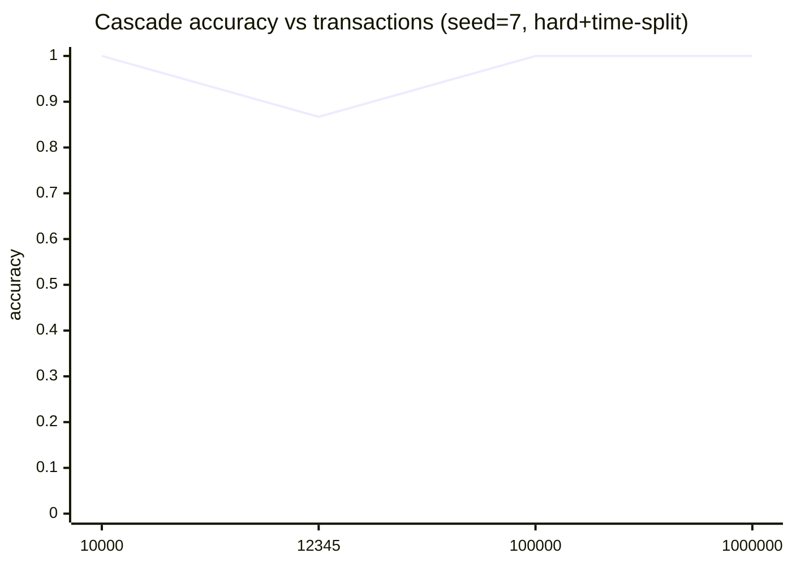
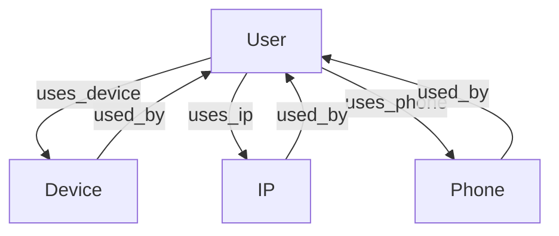
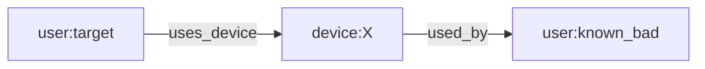
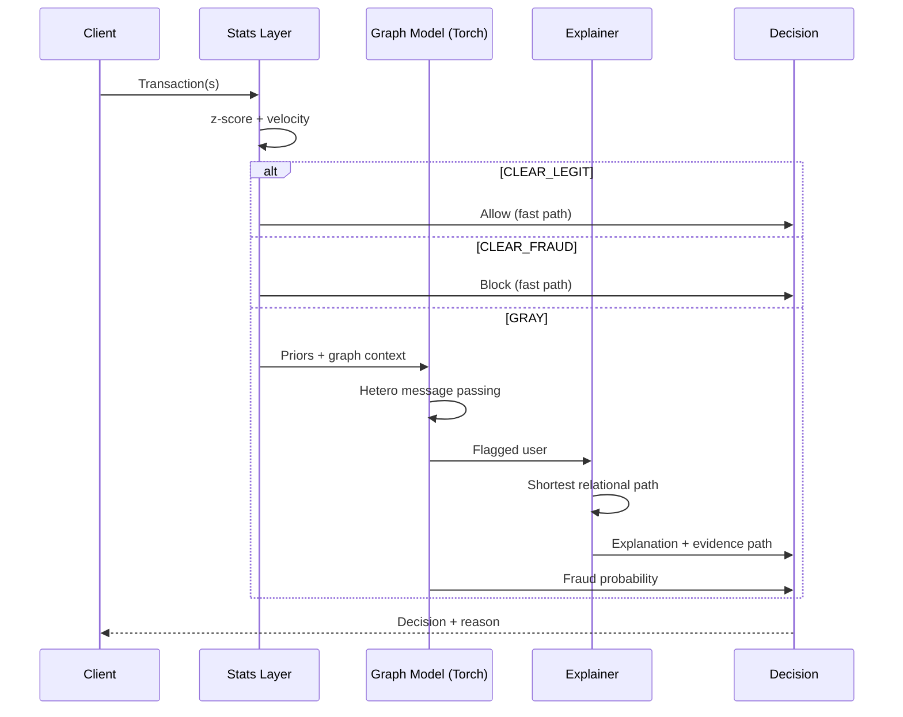

# The Hybrid-Recursive Fraud Defense System

Bridging Deterministic Statistics and Heterogeneous Graph Learning

This repo is a small, readable demo of a two-stage fraud detection cascade:

1. **Deterministic statistics filter** (fast, interpretable)

- Z-score thresholding on amounts
- Velocity checks (txn frequency burst)
- Outputs a **deterministic anomaly score** used as a prior feature

2. **Heterogeneous Graph GNN** (relational reasoning)

- Node types: `user`, `device`, `ip`, `phone`
- Edge types: `user->device`, `user->ip`, `user->phone` (+ reverse edges)
- Trains a small **Hetero-GAT** model on the gray-area subset

3. **Explainable business logic** (actionable paths)

- Produces a shortest **k-hop relational path** from a flagged user to a known-bad anchor node.

## Assumptions + covered scenarios (synthetic demo)

This demo intentionally focuses on **relational fraud rings** ("business logic" abuse), not only single-transaction outliers.

Covered patterns:

- **Collusive rings**: groups of users share a small set of devices/IPs/phones.
- **Bursty behavior**: high velocity inside a short time window.
- **Higher amounts**: fraud transactions tend to have larger lognormal amounts.
- **Gray-area routing**: obvious cases are filtered by stats; complex cases go to the graph model.

Not covered yet (real-world extensions):

- Concept drift over weeks/months, seasonality, and changing attacker strategies.
- Chargeback delays / label noise / partial labels.
- Temporal graph modeling (we treat the graph as static for simplicity).
- Rich device fingerprints and text features.

Additional edge cases to think about (hackathon-style):

- **False positive traps**: shared household devices, corporate NAT, campus Wi-Fi, internet cafes.
- **Adversarial adaptation**: rotating devices/IPs, spacing transactions to evade velocity, camouflaging amounts.
- **Cold-start**: new users/devices/IPs with little history.
- **Sparse graphs**: users with only 1 edge type (device-only / IP-only).
- **Dense hubs**: popular devices/IPs (support, kiosks) that connect many users.
- **Operational constraints**: latency budgets, fail-open/fail-closed, and backpressure.
- **Data quality**: missing phone/device, duplicated IDs, timestamp skew.
- **Label quality**: delayed fraud confirmation, disputed transactions, partial labels.

## Scenario library (1000 cases)

For hackathon pitching and test planning, generate a large case library:

```bash
.\.venv\Scripts\python.exe -m src.case_library --n 1000 --out docs/cases.md
```

Output: [docs/cases.md](docs/cases.md)

## Results (quick validation)

We report **Cascade** metrics (stats for CLEAR + graph model for GRAY) on the **test user split**.

These numbers are from the **exact commands listed** in the validation report. Results can vary with seed, epochs, and hard-mode noise.

Multi-run stress test (hard mode + time split), mean ± std over 5 seeds:

| Metric          |           Value |
| --------------- | --------------: |
| accuracy        | 0.9644 ± 0.0606 |
| precision_fraud | 0.8637 ± 0.2086 |
| recall_fraud    | 1.0000 ± 0.0000 |
| f1_fraud        | 0.9109 ± 0.1428 |
| fpr             | 0.0410 ± 0.0699 |

Scaling spot-checks (seed=7, hard+time-split):

| Transactions | Epochs | accuracy | precision_fraud | recall_fraud | f1_fraud |   fpr |
| -----------: | -----: | -------: | --------------: | -----------: | -------: | ----: |
|       10,000 |     15 |    1.000 |           1.000 |        1.000 |    1.000 | 0.000 |
|       12,345 |     15 |    0.867 |           0.500 |        1.000 |    0.667 | 0.154 |
|      100,000 |     15 |    1.000 |           1.000 |        1.000 |    1.000 | 0.000 |
|    1,000,000 |      5 |    1.000 |           1.000 |        1.000 |    1.000 | 0.000 |

Full command log + diagrams: [docs/validation_results.md](docs/validation_results.md)



## Diagrams

### 1) End-to-end system architecture

```mermaid
flowchart LR
	A[Incoming Transactions] --> B[Phase 1: Statistical Filter]
	B -->|CLEAR_LEGIT| L[Allow / Low Risk]
	B -->|CLEAR_FRAUD| F[Block / High Risk]
	B -->|GRAY| G[Phase 2: Heterogeneous Graph Model]
	B --> P[Deterministic Priors\n(anomaly_score, velocity, z-score)]
	P --> G
	G --> S[Phase 3: Explanation\n(shortest relational path)]
	G --> D[Final Decision]
	S --> D
```

### 2) Data model (heterogeneous graph)



### 3) What an explanation looks like



### 4) Sequence diagram (request to decision)



### 5) Deployment diagram (simple production shape)

```mermaid
flowchart TB
	subgraph Online
		API[Fraud API]
		ST[Stats Filter Service]
		MS[Model Service\n(Torch MPNN)]
		EX[Explanation Service]
	end

	subgraph Data
		FS[Feature Store\n(priors, velocity, z-score)]
		GS[Graph Store\n(user-device-ip-phone edges)]
		LG[Logging / Monitoring]
	end

	API --> ST
	ST -->|CLEAR| API
	ST --> FS
	ST -->|GRAY| MS
	MS --> GS
	MS --> EX
	EX --> API
	API --> LG
```

## Quickstart

If running `python` opens the Microsoft Store on Windows, use the Python Launcher instead: `py`.

### 1) Create env + install deps

```bash
python -m venv .venv
.\.venv\Scripts\activate
pip install -r requirements.txt
```

### 2) (Optional, recommended) Install Torch + DGL

DGL installation depends on your platform/CUDA.

- Install **PyTorch** from the official selector.
- Then install **DGL** following its official install guide.

If Torch is not installed, the project still runs the **statistical layer** and prints outputs, but skips the GNN training.

CPU-only PyTorch (Windows, highest success):

```bash
pip install torch torchvision torchaudio --index-url https://download.pytorch.org/whl/cpu
```

### 3) Run the demo

```bash
py -m src.train

# If `python` is a Microsoft Store alias, this always works:
.\.venv\Scripts\python.exe -m src.train
```

### Large-scale run (100M+ transactions)

For extremely large `--n-transactions` (e.g. `100000000` or `123456789`), use streaming mode so we don't build a giant DataFrame:

```bash
.\.venv\Scripts\python.exe -m src.train --stream --phase1-only --hard --n-transactions 123456789
```

Outputs:

- counts of `CLEAR_LEGIT`, `CLEAR_FRAUD`, `GRAY`
- GNN training metrics (if Torch/DGL available)
- an example explanation path

## Project layout

- `src/data.py` synthetic transaction generator
- `src/stats_layer.py` fast statistical filter + priors
- `src/graph_build.py` build DGL heterograph + node features
- `src/model.py` small Hetero-GAT model
- `src/explain.py` shortest-path explanation output
- `src/train.py` end-to-end pipeline
