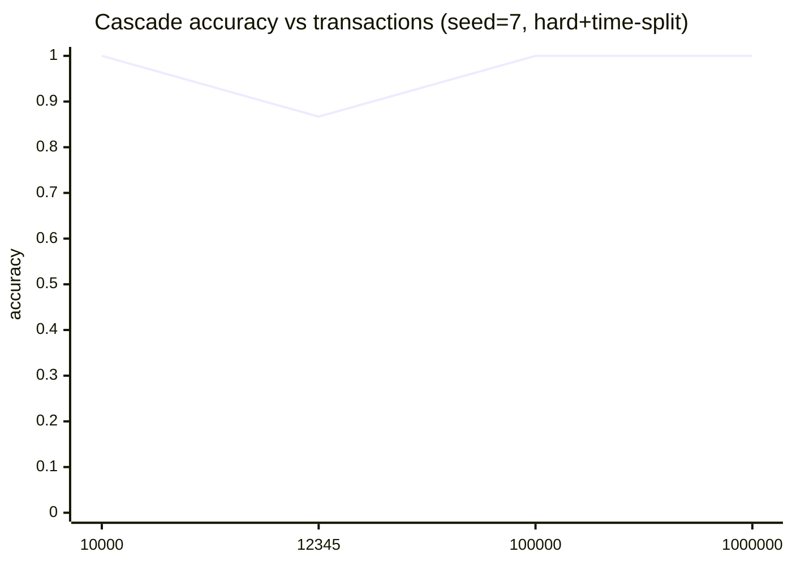
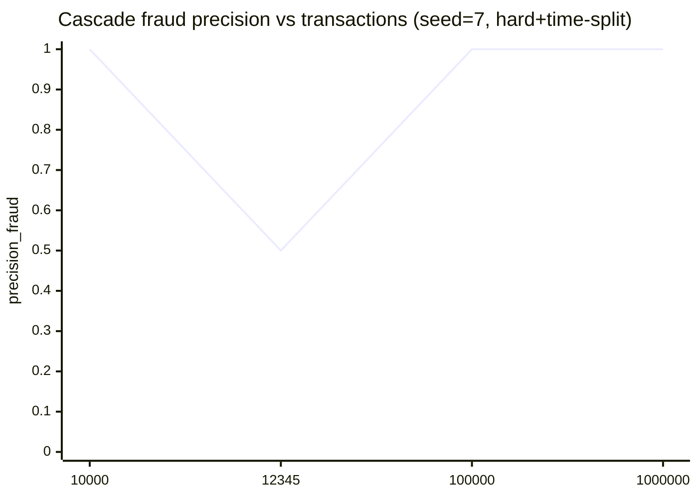
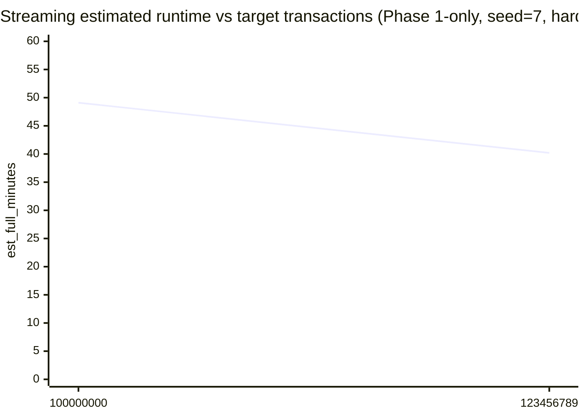
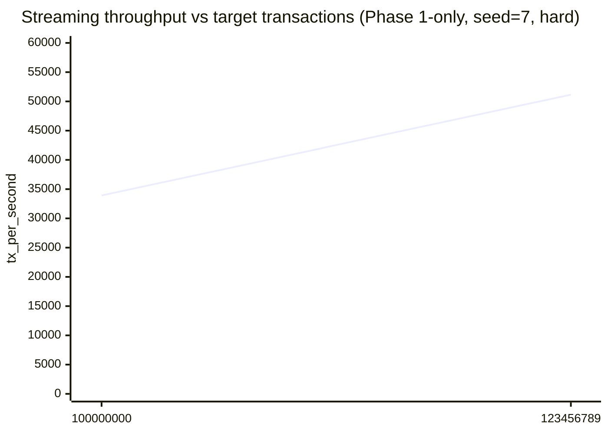

# Validation Results (quick senior check)

This repo is a hackathon demo. The goal of this page is to report _what we actually ran_ and the resulting metrics.

## Definitions

- **Transactions** = synthetic events (Phase 1 operates here)
- **Users** = user nodes in the graph (Phase 2/3 operates here)
- **Cascade** = deterministic stats decisions for CLEAR cases + graph model for GRAY cases
- Metrics are reported on the **test user split**.

## Commands executed

Multi-run stress test (hard mode + time split):

```bash
.\.venv\Scripts\python.exe -m src.train --runs 5 --hard --time-split
```

Single-run scaling checks:

```bash
.\.venv\Scripts\python.exe -m src.train --runs 1 --hard --time-split --n-transactions 10000 --epochs 15
.\.venv\Scripts\python.exe -m src.train --runs 1 --hard --time-split --n-transactions 12345 --epochs 15
.\.venv\Scripts\python.exe -m src.train --runs 1 --hard --time-split --n-transactions 100000 --epochs 15
.\.venv\Scripts\python.exe -m src.train --runs 1 --hard --time-split --n-transactions 1000000 --epochs 5
```

Huge-scale streaming benchmark (Phase 1-only; estimate full runtime):

```bash
.\.venv\Scripts\python.exe -m src.train --stream --phase1-only --hard --n-transactions 100000000 --benchmark-transactions 2000000
.\.venv\Scripts\python.exe -m src.train --stream --phase1-only --hard --n-transactions 123456789 --benchmark-transactions 2000000
```

## Results (Cascade, user-level test split)

### A) Multi-run (5 seeds) hard+time-split

Mean ± std:

| Metric          |           Value |
| --------------- | --------------: |
| accuracy        | 0.9644 ± 0.0606 |
| precision_fraud | 0.8637 ± 0.2086 |
| recall_fraud    | 1.0000 ± 0.0000 |
| f1_fraud        | 0.9109 ± 0.1428 |
| fpr             | 0.0410 ± 0.0699 |

### B) Scaling checks (single seed=7)

| Transactions | Epochs | accuracy | precision_fraud | recall_fraud | f1_fraud |   fpr |
| -----------: | -----: | -------: | --------------: | -----------: | -------: | ----: |
|       10,000 |     15 |    1.000 |           1.000 |        1.000 |    1.000 | 0.000 |
|       12,345 |     15 |    0.867 |           0.500 |        1.000 |    0.667 | 0.154 |
|      100,000 |     15 |    1.000 |           1.000 |        1.000 |    1.000 | 0.000 |
|    1,000,000 |      5 |    1.000 |           1.000 |        1.000 |    1.000 | 0.000 |

### C) Huge-scale benchmark (Phase 1-only, seed=7, hard)

These are Phase 1-only user-level metrics using the built-in threshold-on-GRAY rule, plus a streaming speed estimate.

| Target Transactions | Slice | elapsed (s) | speed (tx/s) | est_full (min) | user_thr | accuracy | precision_fraud | recall_fraud | f1_fraud |  fpr |
| ------------------: | ----: | ----------: | -----------: | -------------: | -------: | -------: | --------------: | -----------: | -------: | ---: |
|         100,000,000 | 2,000,000 |      58.97 |       33,917 |           49.1 |     0.15 |    1.000 |           1.000 |        1.000 |    1.000 | 0.000 |
|         123,456,789 | 2,000,000 |      39.10 |       51,148 |           40.2 |     0.15 |    1.000 |           1.000 |        1.000 |    1.000 | 0.000 |

## Diagram: metrics overview









## Notes (why numbers can look "too good")

- This is still **synthetic data**; scaling the number of transactions increases evidence density.
- For robust conclusions, prefer **multi-run mean±std** and optionally increase graph complexity (more users/devices/hubs).
- Training is stochastic; **epochs and seed matter**. Very low epochs can underfit and significantly reduce metrics.
